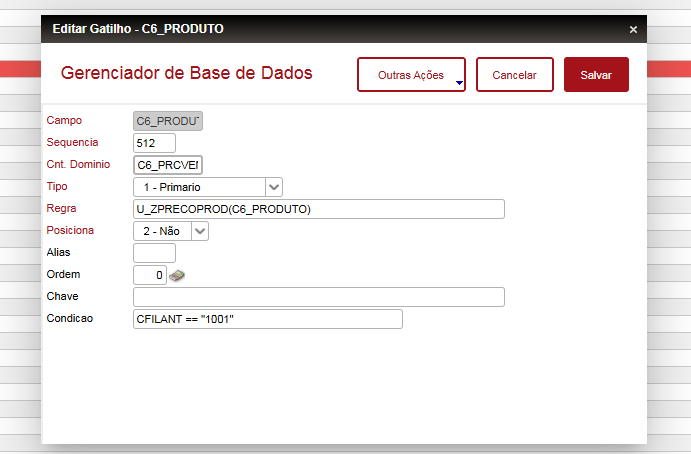

# 🧩 Função ADVPL - ZPRECOPROD

## 📘 Descrição
A função **`ZPRECOPROD()`** tem como objetivo **retornar o último preço de compra** de um determinado produto cadastrado no sistema **TOTVS Protheus**.  
Ela realiza uma consulta direta na tabela **SD1** (documentos de entrada), buscando o registro mais recente de acordo com a data de digitação (`D1_DTDIGIT`).

---

## ⚙️ Como utilizar

Essa função deve ser utilizada no **campo (`C6_PRODUTO`)** "gatilhando" **campo (`C6_PRCVEN`)** no , mas caso queira utilziar em outro campo é necessário ajustar o código fonte e adequar no gatilho.

⚠️**ATENÇÃO!!** 
No exemplo abaixo, o sistema só chama o gatilho se estiver sendo incluido na filial 1001 - Caso queira utilizar em todas as filiais, deve-se remover a condição.

